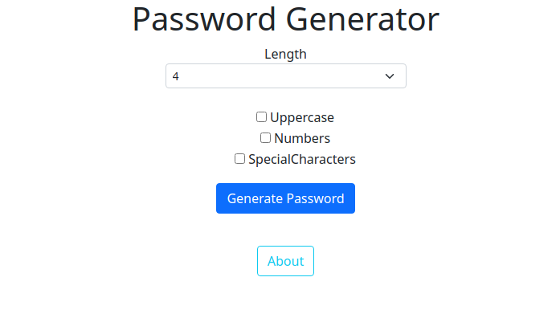

## PASSWORD GENERATOR

> Made with Django3

- You can choose length of your password
- and optional choices as 
  - Numbers
  - Uppercases
  - Special Characters
- And has a small about page

### To try it locally

<h6>Make sure the following needs installed</h6>

- Python 2 or 3
- pip 2 or 3
- Django (install threw a pip)
  > pip install django

<h5>To run it</h5>
<code>python3 manage.py runserver</code>

# Stay optimistic